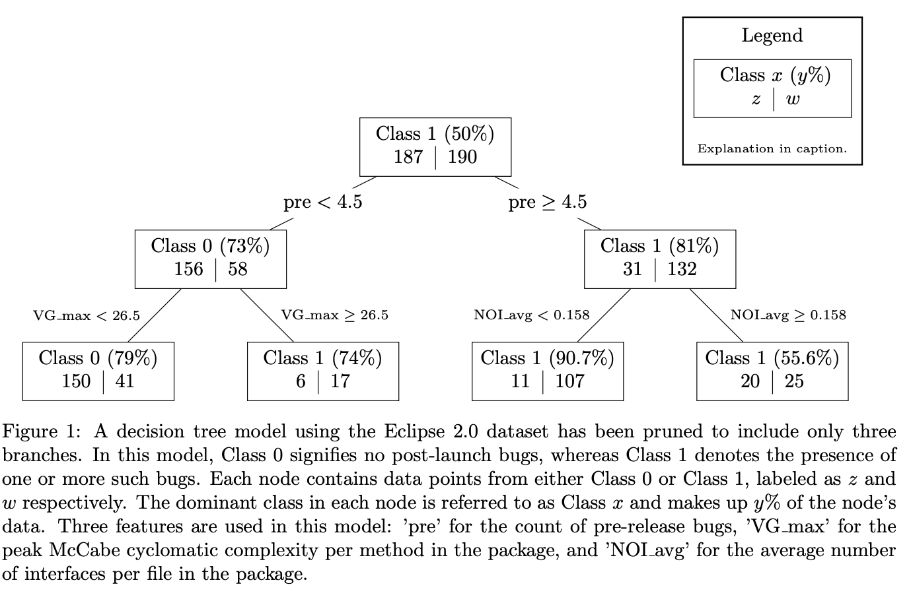

# binary_classification_tree
Simple implementation of a binary classification tree on data with numeric features using the gini-index as an impurity measure. Additionally, bagging and random forests have been implemented.

Run [experiment.py](experiment.py) to train the models on Eclipse 2.0 and predict the presence of bugs on the Eclipse 3.0 dataset. The first experiment uses the vanilla binary decision tree. The second experiment uses the bagging technique while the third experiment runs the random forests algorithm. After running the models a small classification report is shown alongside statistical tests to compare the performance in accuracy between models.

The main functions for growing and testing trees with or without bagging can be found in [main.py](main.py). For random forests, set the "nfeat" parameter to the nearest integer to the square root of the number of predictor variables.

[tree_node.py](tree_node.py) contains the definition of the Tree and Node primitives used by the algorithms. 

[load_data.py](load_data.py) handles the input/output and includes the specific predictor variables that are used.

[fast_split.py](fast_split.py) contains the definition of a numba compiled algorithm for finding the optimal split with highest impurity reduction. Numba compilation is used to speed up this most time consuming step of the algorithm. 

The [requirements.txt](requirements.txt) file specifies the dependencies for the project.

  

## References
- [Dataset used described in T. Zimmermann, R. Premraj and A. Zeller, "Predicting Defects for Eclipse"](https://www.researchgate.net/publication/4261889_Predicting_Defects_for_Eclipse/link/0912f508e35bb6451c000000/download)
